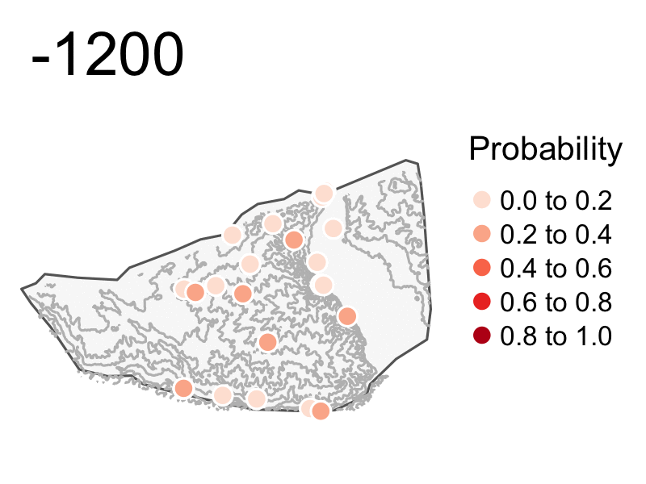

```{r, include=FALSE}
knitr::opts_chunk$set(echo = FALSE,
                      warning = FALSE,
                      tidy = FALSE,
                      message = FALSE,
                      fig.align = 'center',
                      out.width = "100%")
options(knitr.table.format = "html") 
```

# Introduction

The landscape of the Levant and Northern Mesopotamia went through a significant structural change in the Late Bronze and Iron Age, termed as ‘The Great Dispersal’ [@wilkinson_archaeological_2003]. The tell-dominated landscape was superseded by smaller settlements and occasional large cities and new settlements spread into previously uninhabited areas.
The dispersal pattern has been attributed to political activity, namely, centralisation of territorial empires. 

```{r, include=FALSE}
knitr::write_bib(c('posterdown', 'rmarkdown','pagedown'), 'packages.bib')
```

![Figure 1: Politcal landscape of the northern Fertile Crescent at the beginning of the 9th century BCE - after [@Baudains_2015]. ](figures/assyria_empire.png){width=100%}

## Objectives
*	quantify settlements dispersion in time and space
*	characterise rural settlements and their relationship with imperial infrastructure
*	explore political, social and symbolic meaning of the landscape change

## Methodology
*  deluge of `legacy surveys` built upon ‘Fragile Crescent’ and CLASS project database
*  `Spatial Data Science` paradigm
*  tools of trade: `PostGIS, SQL, R, QGIS, GRASS, WhiteboxTools, Git and Github`

![Figure 2: Data Science pipeline - a sequence of processing and analysing steps - is the core of project methodological framework [@grolemund_r_2017].](figures/data_science.png){width=100%}


# Exploratory Data Analysis

*"detect the expected and discover unexpected"* - [@VA1] 

Exploratory Data Analysis is a process of `thinking with data`. The objective is to understand the data through data transformation, visualization and modelling to ask the right questions.
The following section showcases a  reproducible template for an exploration of  `archaeological survey`.

{ width=100% }

![Figure 4: The LCP has recover a total of 80 sites from Upper Palaeolithic to  Late Islamic periods - [@Lawrence_2016]](figures/lcp_elev_map.png){width=100%}

{ width=100% }


![Figure 6: Aoristic analysis helps to deal with uncertainty of periodization by transforming archaeological phases into equal time blocks. Two periods starting at 300 BC and 300 CA represents peak of settlement within study region [@Crema2012].](figures/aoristic_sum_h.png){ width=100% }

{ width=88% }

{ width=100% }

# Why {R}
* R integrates space and time (better than GIS)
* seamless workflows for spatial and non-spatial analysis
* GIS bridges
* automation and reproducibility
* literate programming

#### https://dispersal.rbind.io/

#### References
